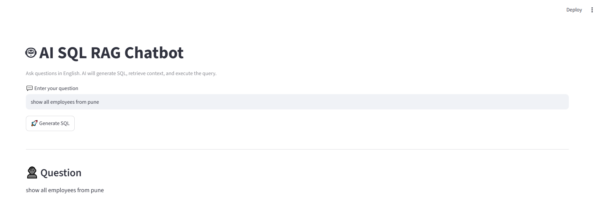
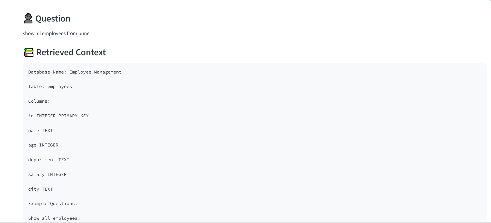
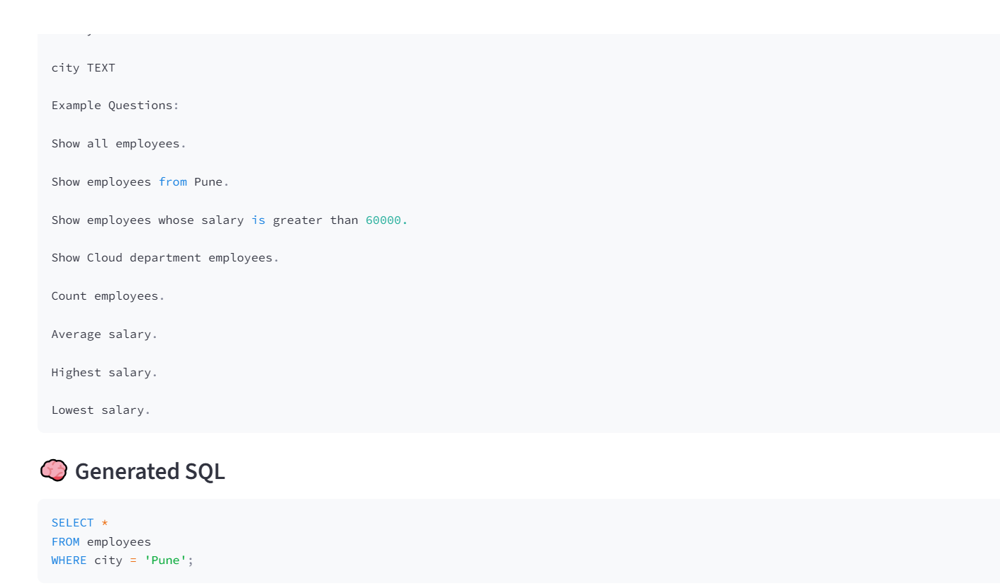
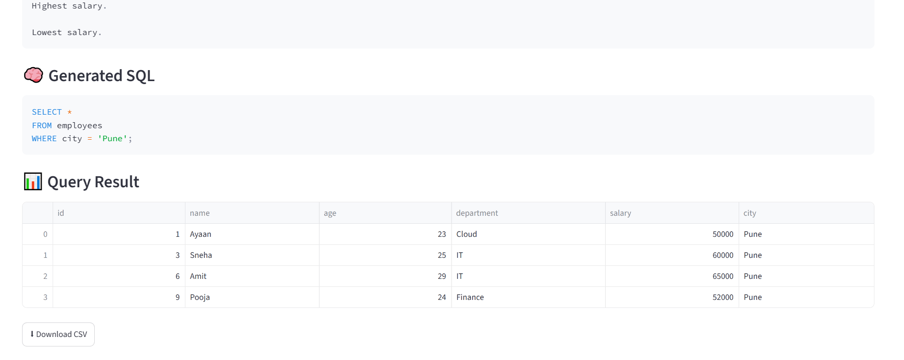

# 🤖 AI SQL RAG Chatbot

An AI-powered SQL chatbot that converts natural language questions into SQL queries using Google's Gemini API and Retrieval-Augmented Generation (RAG). The application securely executes SQL queries on a SQLite database and displays results through a Streamlit interface.

---

## 🚀 Features

- Convert English questions into SQL queries
- RAG (Retrieval-Augmented Generation) using LangChain + FAISS
- Google Gemini AI integration
- SQL Injection Protection
- SQLite Database
- FastAPI Backend
- Streamlit Frontend
- Docker Support
- Modular Project Structure

---

## 🛠 Tech Stack

- Python 3.11
- FastAPI
- Streamlit
- SQLite
- Google Gemini API
- LangChain
- FAISS
- HuggingFace Embeddings
- Pandas
- Docker
- Git & GitHub

---

## 📂 Project Structure

```
AI-SQL-RAG-Chatbot/
│
├── backend/
│   ├── app.py
│   ├── database.py
│   ├── query_generator.py
│   ├── rag.py
│   ├── security.py
│   └── create_db.py
│
├── frontend/
│   └── app.py
│
├── docs/
│   └── schema.txt
│
├── Dockerfile
├── docker-compose.yml
├── requirements.txt
└── README.md
```

---

## ⚙ Installation

Clone the repository

```bash
git clone https://github.com/1225ayaan/AI-SQL-RAG-Chatbot.git
```

Go to project folder

```bash
cd AI-SQL-RAG-Chatbot
```

Create virtual environment

```bash
python -m venv venv
```

Activate environment

### Windows

```bash
venv\Scripts\activate
```

Install dependencies

```bash
pip install -r requirements.txt
```

Run FastAPI

```bash
uvicorn backend.app:app
```

Run Streamlit

```bash
streamlit run frontend/app.py
```

---

## 📚 Example Question

```
Show all employees from Pune
```

Generated SQL

```sql
SELECT *
FROM employees
WHERE city='Pune';
```

---

## 🔒 Security

- SQL Safety Validation
- Dangerous queries are blocked
- Only safe SELECT queries are executed

---

## 🔮 Future Improvements

- PostgreSQL Support
- MySQL Support
- User Authentication
- Chat History
- CSV & Excel Export
- Cloud Deployment (AWS)

---

## 👨‍💻 Author

**Syed Ayaan Jahagirdar**

Cloud | DevOps | AI Enthusiast


## 📸 Project Screenshots

### 🏠 Home Page



### 📚 Retrieved Context



### 🧠 Generated SQL



### 📊 Query Result

